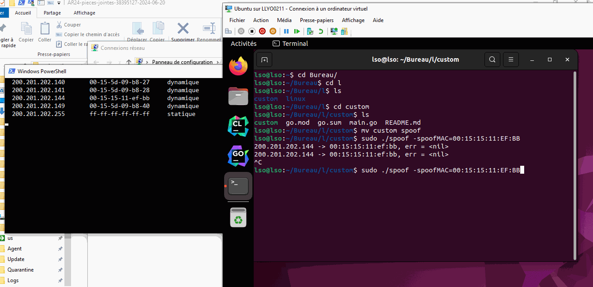

# ARP Spoofing (but not like the others)



## Usage

| Parameter      | Description                                                                   |
|----------------|-------------------------------------------------------------------------------|
| spoofedMAC     | New MAC address to be set                                                     |
| spoofedIP      | Ip entry in the ARP table of victim to be altered                             |
| targetMAC      | MAC address of the victim to send the attack to                               |
| interface      | Interface to use to send attack from                                          |
| listInterfaces | Will list interfaces of the machine                                           |
| interactive    | Run this tool in interactive mode, provide quick way to edit current settings |
| help           | Displays help on how to use this                                              |

### Example

In the commands below, our machine will send packets using interface `eth1` on Linux,
`\Device\NPF_{94E6ABD7-B890-4E28-B454-6613FE5D2136}` on Windows to the machine with MAC address `00:15:5D:09:B8:34`,
that will receive packets telling it machine with IP `200.201.202.144` has MAC address `DE:AD:BE:EF:11:12`.

#### Linux

```bash
sudo ./custom -interface=eth1 -spoofedMAC=DE:AD:BE:EF:11:12 -spoofedIP=200.201.202.144 -targetMAC=00:15:5D:09:B8:34
```

#### Windows

Must be run as administrator

```powershell
.\custom.exe -interface "\Device\NPF_{94E6ABD7-B890-4E28-B454-6613FE5D2136}" -spoofedMAC DE:AD:BE:EF:11:12 -spoofedIP 200.201.202.144
```

## Interactive mode

In interactive mode, you can edit the value by clicking it, or simply increase/decrease it, by overing and using the mouse
wheel for a quick editing.

## Display arp table for given IP root using powershell

```powershell
$IP_ROOT="200.201.202."

while ($True)
{
    $filter = (arp -a | Select-String -Pattern "^ *$IP_ROOT*" -AllMatches) -join "`n"

    Clear-Host
    Write-Host $filter

    Start-Sleep -Seconds 1
}
```

## Author

SOARES Lucas
